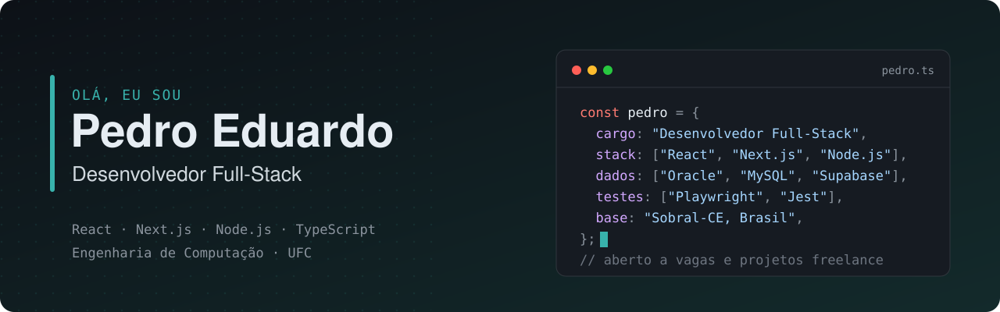

<picture>
  <source media="(prefers-color-scheme: dark)" srcset="./assets/banner-dark.svg">
  <source media="(prefers-color-scheme: light)" srcset="./assets/banner-light.svg">
  
</picture>

  
  
  
  

---

### 👋 Sobre mim

Comecei na TI pelo suporte e pela infraestrutura de rede, e foi resolvendo problemas de quem usa os sistemas no dia a dia que passei a construir esses sistemas.

Como **Analista de TI em uma distribuidora**, sustentei o ERP **TOTVS WinThor**, escrevi consultas em **Oracle** e **MySQL** para relatórios de gestão e desenvolvi aplicações internas em **React** e **Node.js** que ligam os dados do ERP às regras do negócio. Hoje aplico essa experiência em projetos full-stack com **Next.js**, **TypeScript** e **Supabase**.

- 🎓 Engenharia de Computação na **UFC** (conclusão prevista para 2027)
- 📚 Formação full-stack de **1.500 horas** pela **Trybe**
- 💼 Aberto a vagas de desenvolvimento e a projetos freelance

### 🧭 Como eu trabalho

| | |
|---|---|
| 🔒 **Segurança desde o banco** | Regras de acesso no próprio banco (Row Level Security) e validação de toda entrada com Zod. |
| 🧪 **Testado antes de subir** | Testes E2E com Playwright rodando no GitHub Actions a cada push. |
| 📈 **Software a serviço do negócio** | Vim do chão da operação: penso primeiro no processo que o sistema precisa resolver. |

---

### 🚀 Projetos em destaque

<table>
  <tr>
    <td width="50%" valign="top">
      <h4>💰 <a href="https://github.com/devpedroeduardo/my-finpocket">MyFinPocket</a></h4>
      
Aplicação de finanças pessoais, instalável como app (PWA), para registrar receitas e despesas.

      <ul>
        <li>Row Level Security no Supabase e rotas protegidas por middleware</li>
        <li>Validação de dados com Zod</li>
        <li>Testes com Jest e Playwright no CI</li>
      </ul>
      

        
        
        
        
      

      
<a href="https://my-finpocket.vercel.app/"><b>Ver online »</b></a>

    </td>
    <td width="50%" valign="top">
      <h4>📋 <a href="https://github.com/devpedroeduardo/bemobile-project">Bemobile</a></h4>
      
Desafio técnico de front-end: tabela de dados interativa e responsiva.

      <ul>
        <li>Busca e filtragem em tempo real</li>
        <li>Componente acordeão próprio, sem bibliotecas externas</li>
        <li>API simulada com json-server</li>
      </ul>
      

        
        
        
      

    </td>
  </tr>
</table>

---

### 🛠️ Tecnologias

| Área | Ferramentas |
|---|---|
| **Front-end** |      |
| **Back-end** |     |
| **Banco de dados** |    |
| **Testes** |     |
| **DevOps e ferramentas** |      |
| **Sistemas** |  |

---

### 🗺️ Trajetória

| Período | |
|---|---|
| **2025 – 2026** | **Analista de TI** · Distribuidora Donizete — ERP WinThor, Oracle/MySQL, aplicações internas em React e Node.js |
| **2021 – 2022** | **Estagiário de TI e Redes** · Rações Golfinho — suporte, rede local e estações de trabalho |
| **2020 – 2021** | **Desenvolvimento Web Full-Stack** · Trybe — 1.500 horas |
| **2019 – atual** | **Engenharia de Computação** · Universidade Federal do Ceará |

Vamos conversar? <a href="mailto:pedroedu77@gmail.com">pedroedu77@gmail.com</a> · <a href="https://www.linkedin.com/in/devpedroeduardo/">LinkedIn</a>

